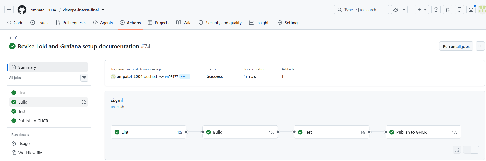
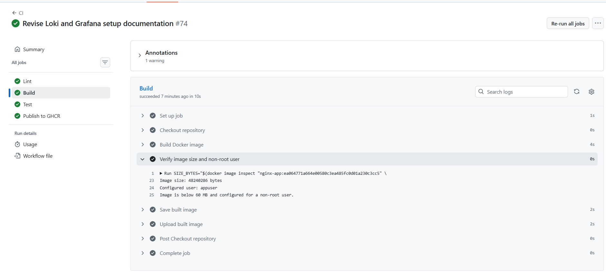
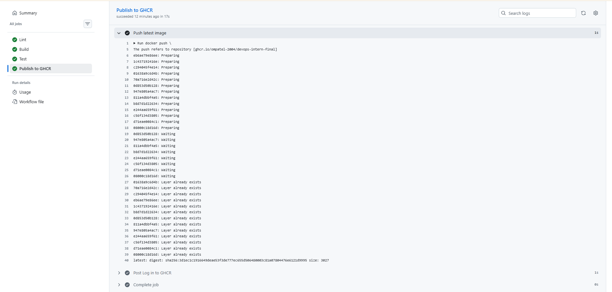
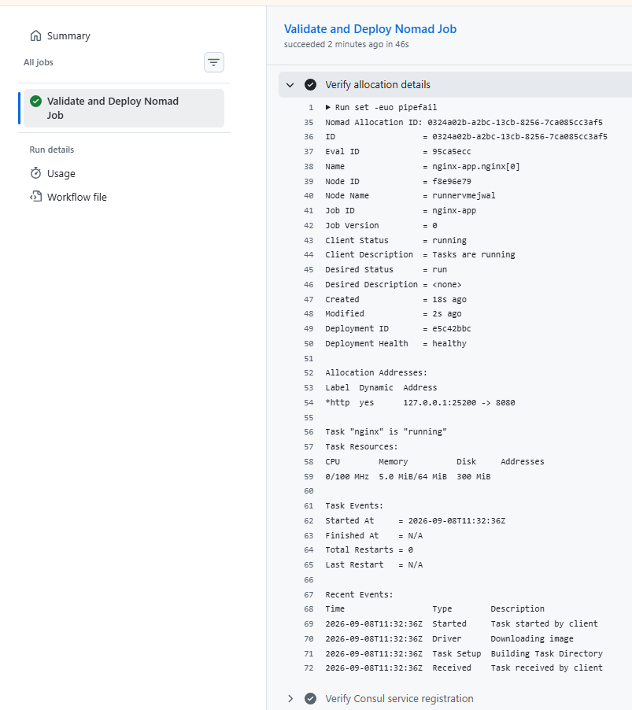
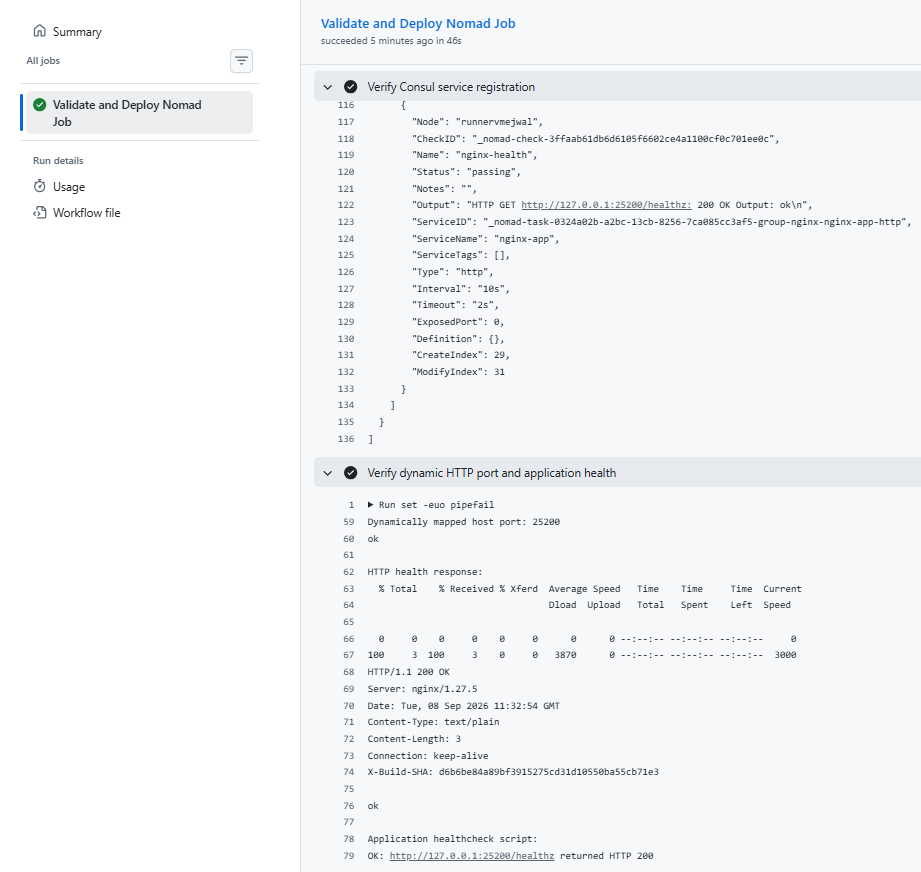

# DevOps Intern Final Assessment


## Submission Details

| Item | Details |
|---|---|
| **Name** | Om Patel |
| **Role** | DevOps Intern |
| **Assessment** | DevOps Intern Final Assessment |
| **Submission Date** | 09 September 2026 |
| **Repository** | `ompatel-2004/devops-intern-final` |
| **Release Tag** | `v1.0.0` |
| **Container Registry** | `ghcr.io/ompatel-2004/devops-intern-final` |

---

# 1. Project Overview

This project implements an end-to-end DevOps pipeline for a small NGINX web application.

The implementation covers:

- Git-based source control
- Feature-branch and pull-request workflow
- Shell scripting and validation
- Docker containerisation
- NGINX on port `8080`
- Non-root container execution
- GitHub Actions CI/CD
- ShellCheck and Hadolint validation
- Docker image build and testing
- GitHub Container Registry (GHCR)
- HashiCorp Nomad deployment
- Consul service registration and health checks
- Dynamic Nomad port allocation
- Loki log aggregation
- Promtail log collection
- Grafana log exploration
- Reproducible documentation
- Troubleshooting and validation evidence

The application serves a static page on port `8080` and provides a `/healthz` endpoint returning HTTP `200`.

The application page displays:

- Name
- Assessment date
- Build identifier injected during the Docker image build

---

# 2. Architecture

```text
                           Developer
                               |
                               v
                     Git / Feature Branch
                               |
                               v
                       GitHub Pull Request
                               |
                               v
                    +-----------------------+
                    |    GitHub Actions     |
                    |-----------------------|
                    | ShellCheck            |
                    | Hadolint              |
                    | Docker Build          |
                    | Application Tests     |
                    | Health Check          |
                    +-----------+-----------+
                                |
                                v
                    +-----------------------+
                    |         GHCR           |
                    |-----------------------|
                    | SHA image tag          |
                    | latest image tag       |
                    +-----------+-----------+
                                |
                                v
                    +-----------------------+
                    |     Nomad + Consul     |
                    |-----------------------|
                    | Docker driver          |
                    | Dynamic HTTP port      |
                    | /healthz check         |
                    | Rolling update         |
                    | Auto-revert            |
                    +-----------+-----------+
                                |
                                v
                         NGINX Application
                                |
                                | container logs
                                v
                            Promtail
                                |
                                v
                              Loki
                                |
                                v
                            Grafana
                                |
                                v
                              LogQL
```

---

# 3. Repository Structure

```text
devops-intern-final/
├── README.md
├── .gitignore
│
├── app/
│   ├── Dockerfile
│   ├── index.html
│   └── nginx.conf
│
├── scripts/
│   ├── sysinfo.sh
│   └── healthcheck.sh
│
├── .github/
│   └── workflows/
│       ├── ci.yml
│       ├── nomad-validation.yml
│       └── observability-validation.yml
│
├── nomad/
│   └── nginx-app.nomad.hcl
│
├── monitoring/
│   ├── docker-compose.yaml
│   ├── loki-config.yaml
│   ├── promtail-config.yaml
│   ├── grafana/
│   │   └── provisioning/
│   │       └── datasources/
│   │           └── datasource.yaml
│   └── loki_setup.md
│
└── docs/
    └── screenshots/
```

---

# 4. Prerequisites

The project can be checked locally using Docker Desktop and Git Bash on Windows, or equivalent Linux/macOS tools.

## Required Tools

| Tool | Version Used |
|---|---|
| Git | Any recent version |
| Docker | `29.7.2` |
| Docker Compose | `v5.5.1` |
| Nomad | `1.7.7` |
| Consul | `1.17.2` |
| ShellCheck | Required for script linting |
| curl | Required for HTTP health checks |

The container images used by the monitoring stack are pinned to:

| Component | Version |
|---|---|
| NGINX | `1.27-alpine` |
| Loki | `2.9.6` |
| Promtail | `2.9.6` |
| Grafana | `11.0.0` |

---

# 5. Local Installation and Verification

This section explains how another person can clone the repository and verify the project locally without relying on the GitHub Actions environment.

## 5.1 Install Git

Install Git for your operating system.

Verify:

```bash
git --version
```

---

## 5.2 Install Docker

Install Docker Desktop for Windows/macOS or Docker Engine for Linux.

Verify:

```bash
docker --version
docker compose version
```

Example environment used for validation:

```text
Docker version 29.7.2
Docker Compose version v5.5.1
```

Make sure the Docker daemon is running.

Verify:

```bash
docker info
```

A successful `docker info` confirms that the Docker daemon is available.

---

## 5.3 Install curl

Verify:

```bash
curl --version
```

`curl` is used by the health-check script and for direct application verification.

---

## 5.4 Install ShellCheck

ShellCheck is required to validate the shell scripts.

Verify:

```bash
shellcheck --version
```

The repository scripts can then be checked with:

```bash
shellcheck scripts/sysinfo.sh scripts/healthcheck.sh
```

A successful run produces no ShellCheck errors.

---

## 5.5 Clone the Repository

Clone the public repository:

```bash
git clone https://github.com/ompatel-2004/devops-intern-final.git
```

Enter the repository:

```bash
cd devops-intern-final
```

Check the current branch and repository state:

```bash
git status
```

---

# 6. Local Application Verification

There are two ways to run the application locally:

1. Build the Docker image from source.
2. Pull the already-published image from GHCR.

Building from source is recommended when reviewing the repository.

---

## 6.1 Build the Application Image

From the repository root:

```bash
docker build \
  --build-arg BUILD_SHA=local-test \
  -t nginx-app:local \
  ./app
```

The `BUILD_SHA` argument is injected into the application during the image build.

---

## 6.2 Check the Image

List the image:

```bash
docker images nginx-app
```

Inspect the image:

```bash
docker image inspect nginx-app:local
```

---

## 6.3 Run the Application

Start the container:

```bash
docker run -d \
  --name nginx-app \
  -p 8080:8080 \
  nginx-app:local
```

Check that it is running:

```bash
docker ps
```

Expected result:

```text
nginx-app
```

---

## 6.4 Check the Application Page

Open the application in a browser:

```text
http://localhost:8080
```

The page displays:

- Name
- Assessment date
- Application
- Port
- Health endpoint
- Build identifier

The build identifier should contain:

```text
local-test
```

because that value was supplied through:

```bash
--build-arg BUILD_SHA=local-test
```

---

## 6.5 Check the Health Endpoint

Run:

```bash
curl -i http://localhost:8080/healthz
```

Expected:

```text
HTTP/1.1 200 OK
```

The response body is:

```text
ok
```

---

## 6.6 Check the Build SHA Header

Run:

```bash
curl -i http://localhost:8080/
```

The response includes:

```text
X-Build-SHA: local-test
```

This confirms that the build identifier was injected during image creation.

---

## 6.7 Run the Health Check Script

Run:

```bash
./scripts/healthcheck.sh
```

Expected:

```text
OK: http://localhost:8080 returned HTTP 200
```

Explicitly test the health endpoint:

```bash
./scripts/healthcheck.sh http://localhost:8080/healthz
```

Expected:

```text
OK: http://localhost:8080/healthz returned HTTP 200
```

---

## 6.8 Test a Failure Case

Run:

```bash
./scripts/healthcheck.sh http://localhost:8080/missing
```

Expected:

```text
FAIL: http://localhost:8080/missing returned HTTP 404 (expected 200)
```

The script returns a non-zero exit code:

```bash
echo $?
```

Expected:

```text
1
```

This verifies that the script correctly fails when the HTTP response is not `200`.

---

## 6.9 Run the System Information Script

Run:

```bash
./scripts/sysinfo.sh
```

The script reports:

- Current user
- Effective UID
- Hostname
- Kernel release
- ISO-8601 date
- Disk usage
- Memory usage
- Docker daemon status

Example output from the validation environment:

```text
=== System Information ===
User: HP
Effective UID: 197609
Hostname: Om2004
Kernel Release: 3.6.5-22c95533.x86_64
System Date (ISO-8601): 2026-09-08T12:37:49Z

--- Disk Usage (human-readable) ---
Filesystem            Size  Used Avail Use% Mounted on
C:/ Program Files/Git 259G 149G 110G 58% /
D:                    218G 100G 118G 46% /d

--- Memory Usage ---
Total Memory: 7.65 GB
Used Memory:  6.58 GB
Free Memory:  1.07 GB

--- Docker Daemon Status ---
Docker daemon: running
```

---

## 6.10 Check Container Health

Docker also provides the image health check.

Run:

```bash
docker inspect \
  --format='{{.State.Health.Status}}' \
  nginx-app
```

After the health check has executed, the expected status is:

```text
healthy
```

---

## 6.11 Check Non-root Execution

Run:

```bash
docker exec nginx-app id
```

The output should show the application user rather than `root`.

---

## 6.12 Check Container Logs

Run:

```bash
docker logs nginx-app
```

This displays the NGINX container logs that are later collected by Promtail in the monitoring setup.

---

## 6.13 Stop the Local Application

When finished:

```bash
docker rm -f nginx-app
```

---

# 7. Published GHCR Image Verification

Instead of building locally, the published image can also be tested directly.

Pull the image:

```bash
docker pull ghcr.io/ompatel-2004/devops-intern-final:latest
```

Run it:

```bash
docker run -d \
  --name nginx-app \
  -p 8080:8080 \
  ghcr.io/ompatel-2004/devops-intern-final:latest
```

Verify:

```bash
curl -i http://localhost:8080/
```

Verify health:

```bash
curl -i http://localhost:8080/healthz
```

Expected:

```text
HTTP/1.1 200 OK
```

Remove the container when finished:

```bash
docker rm -f nginx-app
```

---

# 8. Shell Scripts

The repository contains two shell scripts:

```text
scripts/sysinfo.sh
scripts/healthcheck.sh
```

Both scripts use:

```bash
#!/usr/bin/env bash
set -euo pipefail
```

The scripts are executable in Git.

Verify their permissions:

```bash
git ls-files --stage scripts/sysinfo.sh scripts/healthcheck.sh
```

The expected file mode is:

```text
100755
```

ShellCheck validation:

```bash
shellcheck scripts/sysinfo.sh scripts/healthcheck.sh
```

---

# 9. Containerisation

The Docker application is located under:

```text
app/
├── Dockerfile
├── index.html
└── nginx.conf
```

The Dockerfile uses the pinned NGINX image:

```dockerfile
FROM nginx:1.27-alpine
```

The container:

- Runs as a non-root user.
- Listens on port `8080`.
- Exposes port `8080`.
- Provides `/healthz`.
- Includes a Docker `HEALTHCHECK`.
- Injects `BUILD_SHA`.
- Adds the build identifier to the HTTP response header.

## Build

```bash
docker build \
  --build-arg BUILD_SHA=local-test \
  -t nginx-app:local \
  ./app
```

## Run

```bash
docker run -d \
  --name nginx-app \
  -p 8080:8080 \
  nginx-app:local
```

## Health

```bash
curl -i http://localhost:8080/healthz
```

Expected:

```text
HTTP/1.1 200 OK
```

## Build Identifier

```bash
curl -i http://localhost:8080/
```

Expected header:

```text
X-Build-SHA: local-test
```

## Image Size

Check the image size:

```bash
docker image inspect nginx-app:local \
  --format='{{.Size}} bytes'
```

The validated image size was below the required `60 MB` limit.

---

# 10. Continuous Integration

The main CI workflow is:

```text
.github/workflows/ci.yml
```

The workflow runs on:

- Pushes to `main`
- Pull requests targeting `main`

The pipeline performs:

```text
ShellCheck
    ↓
Hadolint
    ↓
Docker Build
    ↓
Application Tests
    ↓
Health Check
    ↓
GHCR Publication
```

The Docker image is built using the GitHub commit SHA:

```text
BUILD_SHA=${{ github.sha }}
```

The test stage verifies:

- Application startup
- Homepage availability
- `/healthz`
- Health-check script
- Non-root execution
- Build SHA
- Container behaviour

The workflow publishes to GHCR only on pushes to `main`.

Published tags:

```text
<commit-sha>
latest
```

GHCR authentication uses the GitHub-provided `GITHUB_TOKEN`.

No long-lived registry credentials are stored in the repository.

## CI Evidence








---

# 11. Nomad Deployment

The Nomad job specification is:

```text
nomad/nginx-app.nomad.hcl
```

The job uses:

- Service job type
- One group
- One task
- Docker driver
- Parameterised GHCR image tag
- `100 MHz` CPU
- `64 MB` memory
- Dynamic named `http` port
- Container port `8080`
- Consul service registration
- HTTP `/healthz` check
- `10s` health interval
- `2s` timeout
- Rolling update
- `max_parallel = 1`
- `min_healthy_time = 10s`
- `healthy_deadline = 2m`
- `auto_revert = true`
- Restart policy
- Reschedule policy

## Validate

```bash
nomad job validate nomad/nginx-app.nomad.hcl
```

Expected:

```text
Job validation successful
```

## Plan

```bash
nomad job plan \
  -var="image_tag=latest" \
  nomad/nginx-app.nomad.hcl
```

## Run

```bash
nomad job run \
  -var="image_tag=latest" \
  nomad/nginx-app.nomad.hcl
```

## Check Job

```bash
nomad job status nginx-app
```

Expected state:

```text
Desired: 1
Placed: 1
Healthy: 1
Unhealthy: 0
```

## Check Allocation

```bash
nomad alloc status <allocation-id>
```

The validated allocation showed:

```text
Client Status: running
Deployment Health: healthy
CPU: 0 / 100 MHz
Memory: 5.0 MiB / 64 MiB
```

## Consul Health Check

The service is registered with Consul as:

```text
Service: nginx-app
Check: nginx-health
Path: /healthz
Interval: 10s
Timeout: 2s
```

The health check validates the dynamically allocated HTTP port and expects HTTP `200`.

## Nomad Evidence






---

# 12. Local Loki, Promtail and Grafana

The monitoring stack is located under:

```text
monitoring/
```

It contains:

```text
monitoring/
├── docker-compose.yaml
├── loki-config.yaml
├── promtail-config.yaml
├── grafana/
│   └── provisioning/
│       └── datasources/
│           └── datasource.yaml
└── loki_setup.md
```

The stack is:

```text
NGINX
  ↓
Docker Logs
  ↓
Promtail
  ↓
Loki
  ↓
Grafana
  ↓
LogQL
```

---

## 12.1 Start the Monitoring Stack

From the repository root:

```bash
cd monitoring
docker compose up -d
```

Check the services:

```bash
docker compose ps
```

Expected services:

```text
loki
promtail
grafana
```

The validated versions are:

```text
Loki:     2.9.6
Promtail: 2.9.6
Grafana:  11.0.0
```

---

## 12.2 Verify Loki

Open:

```text
http://localhost:3100
```

Or check its readiness endpoint:

```bash
curl http://localhost:3100/ready
```

---

## 12.3 Open Grafana

Open:

```text
http://localhost:3000
```

Local assessment credentials:

```text
Username: admin
Password: admin
```

The Loki datasource is provisioned automatically.

---

## 12.4 Start NGINX for Log Testing

Return to the repository root:

```bash
cd ..
```

Build:

```bash
docker build \
  --build-arg BUILD_SHA=local-grafana-test \
  -t nginx-app:local \
  ./app
```

Run:

```bash
docker run -d \
  --name nginx-app \
  -p 8080:8080 \
  nginx-app:local
```

---

## 12.5 Generate a Deliberate HTTP 404

Generate an NGINX access-log entry:

```bash
curl -i http://localhost:8080/assessment-missing-path
```

Expected:

```text
HTTP/1.1 404 Not Found
```

This deliberately generates a non-200 NGINX access log.

---

## 12.6 Verify Docker Logs

Run:

```bash
docker logs nginx-app
```

The generated request should appear in the NGINX access logs.

---

## 12.7 Verify Loki Labels

Run:

```bash
curl -s http://localhost:3100/loki/api/v1/labels
```

The Promtail configuration provides labels including:

```text
container
job
service
```

For the NGINX container:

```text
container = nginx-app
job       = nginx-docker
service   = nginx-app
```

---

## 12.8 Query Logs in Grafana

Open:

```text
http://localhost:3000
```

Go to:

```text
Explore → Loki
```

Run:

```logql
{container="nginx-app"} |= "404"
```

This query isolates NGINX log entries containing HTTP `404`.

The observed result included:

```text
GET /assessment-missing-path HTTP/1.1" 404
```

This confirms:

```text
NGINX
  ↓
Docker logs
  ↓
Promtail
  ↓
Loki
  ↓
Grafana
  ↓
LogQL
```

## Grafana Evidence


Additional monitoring instructions are available in:

```text
monitoring/loki_setup.md
```

---

# 13. Continuous Integration and Deployment Flow

The complete application flow is:

```text
Developer
    |
    v
Git Feature Branch
    |
    v
Pull Request
    |
    v
GitHub Actions
    |
    +--> ShellCheck
    |
    +--> Hadolint
    |
    +--> Docker Build
    |
    +--> Application Tests
    |
    +--> Health Check
    |
    v
GHCR
    |
    v
Nomad
    |
    v
Consul
    |
    v
NGINX
    |
    v
Promtail
    |
    v
Loki
    |
    v
Grafana
    |
    v
LogQL
```

---

# 14. End-to-End Validation

The project was validated across the complete workflow rather than only by checking individual configuration files.

The final validation demonstrates:

```text
1. Source code stored in GitHub
2. Feature branch / pull-request workflow
3. GitHub Actions linting
4. Docker image build
5. Application testing
6. Health-check validation
7. GHCR image publication
8. Nomad deployment
9. Consul service registration
10. Consul /healthz validation
11. Running NGINX application
12. NGINX container logs
13. Promtail log collection
14. Loki ingestion
15. Grafana Explore
16. LogQL query
17. Retrieval of the expected NGINX log entry
```

---

# 15. Troubleshooting

## Nomad Binary Extraction Conflict

The repository contains a directory named:

```text
nomad/
```

An initial Nomad binary extraction attempted to use a conflicting location.

The solution was to extract the Nomad binary into a temporary directory instead of the repository `nomad/` directory.

The repository `nomad/` directory remains dedicated to the Nomad job specification.

---

## Nomad Docker Driver Not Detected

Nomad initially could not detect the Docker driver.

The validation environment was corrected by starting Docker and configuring:

```text
DOCKER_HOST=unix:///var/run/docker.sock
```

After the correction, the Docker driver was detected and the deployment succeeded.

---

## Incorrect Nomad Driver JSON Field

The validation workflow initially checked an incorrect JSON field when verifying Docker driver availability.

It was corrected to check:

```text
Drivers.docker.Detected
Drivers.docker.Healthy
```

Driver validation then succeeded.

---

## GHCR Image Unavailable During Pull Request Validation

Pull-request validation attempted to use a SHA-tagged image that had not yet been published.

GHCR publication is restricted to pushes to `main`.

The workflow was therefore structured so that pull requests validate the Nomad configuration without requiring a PR-specific published image, while the `main` workflow publishes the image before deployment validation.

---

## Nomad Plan Exit Code

During validation, `nomad job plan` returned exit code `1` even though the output indicated a valid plan and successful task allocation.

The validation workflow was adjusted to distinguish a valid Nomad plan result from an actual command failure.

---

## Loki Log Verification

Starting Loki and Promtail alone did not demonstrate that NGINX logs were being ingested.

A deliberate missing path was therefore requested:

```text
/assessment-missing-path
```

The endpoint returned:

```text
404
```

The resulting NGINX access log was then located in Grafana using:

```logql
{container="nginx-app"} |= "404"
```

This confirmed the complete NGINX → Promtail → Loki → Grafana path.

---

# 16. Security

The repository does not contain:

- Long-lived cloud credentials
- Registry passwords
- Private keys
- Access tokens

GitHub Actions authenticates to GHCR using:

```text
GITHUB_TOKEN
```

with the required package permissions.

No long-lived registry credentials are committed to the repository.

Grafana's `admin/admin` credentials are intended only for the local assessment environment and should not be used as production credentials.

---

# 17. Known Limitations

This implementation is an assessment environment rather than a production deployment platform.

- The Nomad environment used for validation is a local/test environment rather than a production multi-node cluster.
- Grafana uses local assessment credentials rather than production identity management.
- Loki and Grafana use local Docker volumes rather than production external storage.
- The monitoring implementation focuses on log aggregation rather than a complete metrics and alerting platform.
- The NGINX application is a static assessment application rather than a production business workload.

Potential production improvements include:

- TLS
- External secret management
- Production IAM
- Persistent object storage for Loki
- Multi-node Nomad
- High availability
- Centralized monitoring
- Alerting
- Automated infrastructure provisioning

---

# 18. Evidence Screenshots

All supporting evidence is stored under:

```text
docs/screenshots/
```

## CI Pipeline


## Docker Build


## Application Tests


## GHCR Publication


## Nomad Validation, Plan and Run


## Nomad Health Status


## Nomad Deployment


## Consul Health


## Grafana Loki Explore


---

# 19. Final Verification

The completed repository contains:

- Git source control
- Feature branch workflow
- Pull-request workflow
- Final `v1.0.0` release tag
- Linux shell scripts
- ShellCheck validation
- Hadolint validation
- Pinned NGINX base image
- Non-root container execution
- `/healthz` endpoint
- Build SHA injection
- GitHub Actions CI/CD
- GHCR image publication
- Nomad orchestration
- Consul health checking
- Loki log aggregation
- Promtail log collection
- Grafana log exploration
- LogQL validation
- Troubleshooting documentation
- Known limitations
- Supporting screenshots

Final release:

```text
v1.0.0
```

Final tagged commit:

```text
0219e2e9b950129f9dcbfb21d9d522017db88244
```

Repository:

```text
https://github.com/ompatel-2004/devops-intern-final
```

Container image:

```text
ghcr.io/ompatel-2004/devops-intern-final:latest
```

---

# 20. Submission

Repository:

https://github.com/ompatel-2004/devops-intern-final

Final release:

https://github.com/ompatel-2004/devops-intern-final/releases/tag/v1.0.0

The repository contains the complete CI/CD pipeline, containerised NGINX application, GHCR publication, Nomad deployment, Consul health checks, Loki/Promtail/Grafana observability configuration, reproducible local installation and verification instructions, observed validation results, troubleshooting details, known limitations, and supporting evidence screenshots.

The `v1.0.0` tag represents the final completed assessment state.
