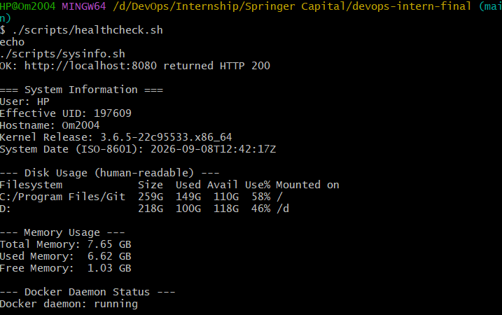
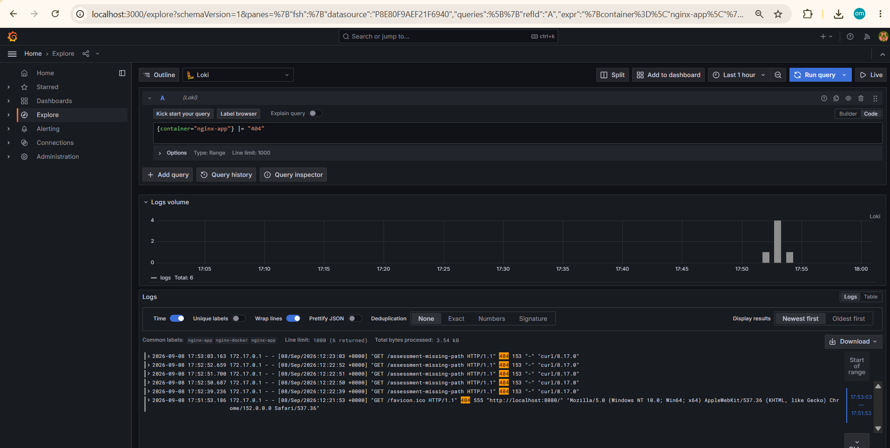
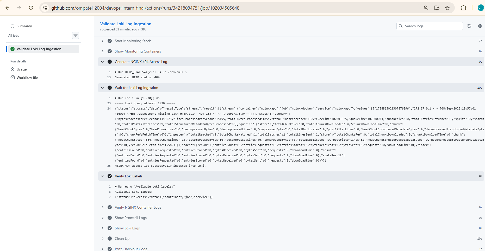

# DevOps Intern Final Assessment


## Submission Details

| Item | Details |
|---|---|
| **Name** | Om Patel |
| **Role** | DevOps Intern |
| **Assessment** | DevOps Intern Final Assessment |
| **Submission Date** | 09 September 2026 |
| **Repository** | `ompatel-2004/devops-intern-final` |
| **Release Tag** | `v1.0.0` |
| **Container Registry** | `ghcr.io/ompatel-2004/devops-intern-final` |

---

# 1. Project Overview

This project implements an end-to-end DevOps pipeline for a small NGINX web application.

The implementation covers:

- Git-based source control
- Feature-branch and pull-request workflow
- Shell scripting and validation
- Docker containerisation
- NGINX on port `8080`
- Non-root container execution
- GitHub Actions CI/CD
- ShellCheck and Hadolint validation
- Docker image build and testing
- GitHub Container Registry (GHCR)
- HashiCorp Nomad deployment
- Consul service registration and health checks
- Dynamic Nomad port allocation
- Loki log aggregation
- Promtail log collection
- Grafana log exploration
- Reproducible local installation
- End-to-end validation
- Troubleshooting documentation
- Evidence screenshots

The application serves a static web page on port `8080` and provides a `/healthz` endpoint returning HTTP `200`.

The application page displays:

- Name
- Assessment date
- Application information
- Port
- Health endpoint
- Build identifier injected during the Docker image build

---

# 2. Architecture

```text
                           Developer
                               |
                               v
                     Git / Feature Branch
                               |
                               v
                       GitHub Pull Request
                               |
                               v
                    +-----------------------+
                    |    GitHub Actions     |
                    |-----------------------|
                    | ShellCheck            |
                    | Hadolint              |
                    | Docker Build          |
                    | Application Tests     |
                    | Health Check          |
                    +-----------+-----------+
                                |
                                v
                    +-----------------------+
                    |         GHCR           |
                    |-----------------------|
                    | SHA image tag          |
                    | latest image tag       |
                    +-----------+-----------+
                                |
                                v
                    +-----------------------+
                    |     Nomad + Consul     |
                    |-----------------------|
                    | Docker driver          |
                    | Dynamic HTTP port      |
                    | /healthz check         |
                    | Rolling update         |
                    | Auto-revert            |
                    +-----------+-----------+
                                |
                                v
                         NGINX Application
                                |
                                | Container Logs
                                v
                            Promtail
                                |
                                v
                              Loki
                                |
                                v
                            Grafana
                                |
                                v
                              LogQL
```

---

# 3. Repository Structure

```text
devops-intern-final/
│
├── README.md
├── .gitignore
│
├── app/
│   ├── Dockerfile
│   ├── index.html
│   └── nginx.conf
│
├── scripts/
│   ├── sysinfo.sh
│   └── healthcheck.sh
│
├── .github/
│   └── workflows/
│       ├── ci.yml
│       ├── nomad-validation.yml
│       └── observability-validation.yml
│
├── nomad/
│   └── nginx-app.nomad.hcl
│
├── monitoring/
│   ├── docker-compose.yaml
│   ├── loki-config.yaml
│   ├── promtail-config.yaml
│   ├── grafana/
│   │   └── provisioning/
│   │       └── datasources/
│   │           └── datasource.yaml
│   └── loki_setup.md
│
└── docs/
    └── screenshots/
        ├── NGINX Running.png
        ├── ci test.png
        ├── ci-build.png
        ├── ci-pipeline.png
        ├── ghcr-image.png
        ├── grafana-loki.png
        ├── nomad Validate-Plan-Run.png
        ├── nomad health status.png
        ├── nomad-consul-health.png
        ├── nomad-deployment.png
        ├── observability-validation.png
        └── sysinfo-healthcheck.png
```

---

# 4. Prerequisites

The project can be tested locally using Docker Desktop and Git Bash on Windows, or equivalent Linux/macOS tooling.

## Required Tools

| Tool | Version Used |
|---|---|
| Git | Recent version |
| Docker | `29.7.2` |
| Docker Compose | `v5.5.1` |
| Nomad | `1.7.7` |
| Consul | `1.17.2` |
| ShellCheck | Required for shell-script linting |
| curl | Required for HTTP health checks |

## Container Versions

| Component | Version |
|---|---|
| NGINX | `1.27-alpine` |
| Loki | `2.9.6` |
| Promtail | `2.9.6` |
| Grafana | `11.0.0` |

---

# 5. Local Installation and Verification

This section explains how a reviewer can clone the repository and verify the application locally.

The application can be tested without GitHub Actions or a remote Nomad cluster.

---

## 5.1 Install Git

Install Git for the operating system.

Verify the installation:

```bash
git --version
```

---

## 5.2 Install Docker

Install Docker Desktop on Windows/macOS or Docker Engine on Linux.

Verify:

```bash
docker --version
docker compose version
```

Example validation environment:

```text
Docker version 29.7.2
Docker Compose version v5.5.1
```

Make sure the Docker daemon is running.

Verify:

```bash
docker info
```

---

## 5.3 Verify curl

Verify:

```bash
curl --version
```

`curl` is used by the health-check script and for direct HTTP verification.

---

## 5.4 Verify ShellCheck

Verify:

```bash
shellcheck --version
```

Then run:

```bash
shellcheck scripts/sysinfo.sh scripts/healthcheck.sh
```

A successful run produces no ShellCheck errors.

---

## 5.5 Clone the Repository

```bash
git clone https://github.com/ompatel-2004/devops-intern-final.git
```

Enter the repository:

```bash
cd devops-intern-final
```

Check the repository:

```bash
git status
```

---

# 6. Quick Start

The following commands provide a minimal local application test.

```bash
git clone https://github.com/ompatel-2004/devops-intern-final.git
cd devops-intern-final
docker build --build-arg BUILD_SHA=local-test -t nginx-app:local ./app
docker run -d --name nginx-app -p 8080:8080 nginx-app:local
curl -i http://localhost:8080/
curl -i http://localhost:8080/healthz
./scripts/healthcheck.sh
```

The application should be available at:

```text
http://localhost:8080
```

---

# 7. Local Application Verification

## 7.1 Build the Docker Image

From the repository root:

```bash
docker build \
  --build-arg BUILD_SHA=local-test \
  -t nginx-app:local \
  ./app
```

The `BUILD_SHA` value is injected into the image during the build.

---

## 7.2 Check the Image

```bash
docker images nginx-app
```

Inspect the image:

```bash
docker image inspect nginx-app:local
```

---

## 7.3 Run the Container

```bash
docker run -d \
  --name nginx-app \
  -p 8080:8080 \
  nginx-app:local
```

Check the running container:

```bash
docker ps
```

Expected container:

```text
nginx-app
```

---

## 7.4 Open the Application

Open the following address in a browser:

```text
http://localhost:8080
```

The page displays the assessment information and build identifier.


---

## 7.5 Test the Health Endpoint

```bash
curl -i http://localhost:8080/healthz
```

Expected:

```text
HTTP/1.1 200 OK
```

Response:

```text
ok
```

---

## 7.6 Verify the Build Identifier

```bash
curl -i http://localhost:8080/
```

The response includes:

```text
X-Build-SHA: local-test
```

This verifies that the build identifier was injected during image creation.

---

## 7.7 Run the Health Check Script

```bash
./scripts/healthcheck.sh
```

Expected:

```text
OK: http://localhost:8080 returned HTTP 200
```

Explicit health endpoint:

```bash
./scripts/healthcheck.sh http://localhost:8080/healthz
```

Expected:

```text
OK: http://localhost:8080/healthz returned HTTP 200
```

---

## 7.8 Test Health Check Failure

Run:

```bash
./scripts/healthcheck.sh http://localhost:8080/missing
```

Expected:

```text
FAIL: http://localhost:8080/missing returned HTTP 404 (expected 200)
```

Check the exit status:

```bash
echo $?
```

Expected:

```text
1
```

This confirms that the script correctly fails when the HTTP response is not `200`.

---

## 7.9 Run the System Information Script

```bash
./scripts/sysinfo.sh
```

The script reports:

- Current user
- Effective UID
- Hostname
- Kernel release
- ISO-8601 date
- Disk usage
- Memory usage
- Docker daemon status

Example output from the validation environment:

```text
=== System Information ===
User: HP
Effective UID: 197609
Hostname: Om2004
Kernel Release: 3.6.5-22c95533.x86_64
System Date (ISO-8601): 2026-09-08T12:37:49Z

--- Disk Usage (human-readable) ---
Filesystem            Size  Used Avail Use% Mounted on
C:/ Program Files/Git 259G 149G 110G 58% /
D:                    218G 100G 118G 46% /d

--- Memory Usage ---
Total Memory: 7.65 GB
Used Memory:  6.58 GB
Free Memory:  1.07 GB

--- Docker Daemon Status ---
Docker daemon: running
```

Evidence:



---

## 7.10 Check Container Health

The Dockerfile defines a container health check.

Run:

```bash
docker inspect \
  --format='{{.State.Health.Status}}' \
  nginx-app
```

Expected after the health check runs:

```text
healthy
```

---

## 7.11 Verify Non-root Execution

Run:

```bash
docker exec nginx-app id
```

The application runs as the configured non-root user.

---

## 7.12 View Container Logs

```bash
docker logs nginx-app
```

The NGINX access logs are later collected by Promtail.

---

## 7.13 Stop the Application

```bash
docker rm -f nginx-app
```

---

# 8. Shell Scripts

The repository contains two shell scripts:

```text
scripts/sysinfo.sh
scripts/healthcheck.sh
```

Both scripts use:

```bash
#!/usr/bin/env bash
set -euo pipefail
```

## ShellCheck

Run:

```bash
shellcheck scripts/sysinfo.sh scripts/healthcheck.sh
```

## Verify Git Executable Permissions

```bash
git ls-files --stage scripts/sysinfo.sh scripts/healthcheck.sh
```

The expected file mode is:

```text
100755
```

---

# 9. Containerisation

The application container is located under:

```text
app/
├── Dockerfile
├── index.html
└── nginx.conf
```

The Dockerfile uses the pinned NGINX base image:

```dockerfile
FROM nginx:1.27-alpine
```

The container:

- Runs as a non-root user
- Listens on port `8080`
- Exposes port `8080`
- Provides `/healthz`
- Includes a Docker `HEALTHCHECK`
- Injects `BUILD_SHA`
- Adds the build identifier to the HTTP response header

---

## Build

```bash
docker build \
  --build-arg BUILD_SHA=local-test \
  -t nginx-app:local \
  ./app
```

## Run

```bash
docker run -d \
  --name nginx-app \
  -p 8080:8080 \
  nginx-app:local
```

## Homepage

```bash
curl -i http://localhost:8080/
```

## Health

```bash
curl -i http://localhost:8080/healthz
```

Expected:

```text
HTTP/1.1 200 OK
```

## Build SHA

```bash
curl -i http://localhost:8080/
```

Expected header:

```text
X-Build-SHA: local-test
```

## Image Size

Check:

```bash
docker image inspect nginx-app:local \
  --format='{{.Size}} bytes'
```

The validated image is below the required `60 MB` limit.

---

# 10. Continuous Integration

The main CI workflow is:

```text
.github/workflows/ci.yml
```

The workflow runs on:

- Pushes to `main`
- Pull requests targeting `main`

The pipeline performs:

```text
ShellCheck
    |
    v
Hadolint
    |
    v
Docker Build
    |
    v
Application Tests
    |
    v
Health Check
    |
    v
GHCR Publication
```

The Docker image is built using the GitHub commit SHA:

```text
BUILD_SHA=${{ github.sha }}
```

The test stage verifies:

- Application startup
- Homepage availability
- `/healthz`
- Health-check script
- Non-root execution
- Build SHA
- Container behaviour

GHCR publication occurs only on pushes to `main`.

Published tags:

```text
<commit-sha>
latest
```

GitHub Actions uses the provided `GITHUB_TOKEN` for GHCR authentication.

No long-lived registry credentials are committed to the repository.

---

## CI Evidence

### CI Pipeline


### Docker Build


### CI Test


### GHCR Image


---

# 11. GHCR Image

The final application image is published to:

```text
ghcr.io/ompatel-2004/devops-intern-final
```

The main branch publishes:

```text
latest
```

and a commit-SHA tag.

Pull the image:

```bash
docker pull ghcr.io/ompatel-2004/devops-intern-final:latest
```

Run:

```bash
docker run -d \
  --name nginx-app \
  -p 8080:8080 \
  ghcr.io/ompatel-2004/devops-intern-final:latest
```

Verify:

```bash
curl -i http://localhost:8080/
```

Health:

```bash
curl -i http://localhost:8080/healthz
```

Remove the container:

```bash
docker rm -f nginx-app
```

Evidence:


---

# 12. Nomad Deployment

The Nomad job specification is:

```text
nomad/nginx-app.nomad.hcl
```

The job contains:

- Service job type
- One group
- One task
- Docker driver
- Parameterised GHCR image tag
- `100 MHz` CPU
- `64 MB` memory
- Dynamic named `http` port
- Container port `8080`
- Consul service registration
- HTTP `/healthz` check
- `10s` health interval
- `2s` timeout
- Rolling update
- `max_parallel = 1`
- `min_healthy_time = 10s`
- `healthy_deadline = 2m`
- `auto_revert = true`
- Restart policy
- Reschedule policy

---

## 12.1 Install Nomad

Nomad version used for validation:

```text
1.7.7
```

Verify:

```bash
nomad version
```

---

## 12.2 Install Consul

Consul version used for validation:

```text
1.17.2
```

Verify:

```bash
consul version
```

---

## 12.3 Start Local Nomad and Consul

For local testing, Nomad and Consul can be started in development mode.

Start Consul:

```bash
consul agent -dev
```

In another terminal, start Nomad:

```bash
nomad agent -dev -bind=0.0.0.0
```

The Docker daemon must also be running.

---

## 12.4 Validate Nomad Job

```bash
nomad job validate nomad/nginx-app.nomad.hcl
```

Expected:

```text
Job validation successful
```

---

## 12.5 Plan the Job

```bash
nomad job plan \
  -var="image_tag=latest" \
  nomad/nginx-app.nomad.hcl
```

---

## 12.6 Run the Job

```bash
nomad job run \
  -var="image_tag=latest" \
  nomad/nginx-app.nomad.hcl
```

---

## 12.7 Check Job Status

```bash
nomad job status nginx-app
```

Expected deployment state:

```text
Desired: 1
Placed: 1
Healthy: 1
Unhealthy: 0
```

---

## 12.8 Check Allocation

Get the allocation ID:

```bash
nomad job status nginx-app
```

Then:

```bash
nomad alloc status <allocation-id>
```

The validated deployment showed:

```text
Client Status: running
Deployment Health: healthy
CPU: 0 / 100 MHz
Memory: 5.0 MiB / 64 MiB
```

---

## 12.9 Consul Health Check

The service is registered in Consul as:

```text
Service: nginx-app
Check: nginx-health
Path: /healthz
Interval: 10s
Timeout: 2s
```

The check validates the dynamically allocated HTTP port and expects HTTP `200`.

---

## Nomad Evidence

### Nomad Validate, Plan and Run


### Nomad Health Status


### Nomad Deployment


### Consul Health


---

# 13. Loki, Promtail and Grafana

The monitoring stack is located under:

```text
monitoring/
```

It contains:

```text
monitoring/
├── docker-compose.yaml
├── loki-config.yaml
├── promtail-config.yaml
├── grafana/
│   └── provisioning/
│       └── datasources/
│           └── datasource.yaml
└── loki_setup.md
```

The monitoring flow is:

```text
NGINX
   |
   v
Docker Logs
   |
   v
Promtail
   |
   v
Loki
   |
   v
Grafana
   |
   v
LogQL
```

---

# 14. Start the Monitoring Stack

From the repository root:

```bash
cd monitoring
docker compose up -d
```

Check the services:

```bash
docker compose ps
```

Expected services:

```text
loki
promtail
grafana
```

Versions:

```text
Loki:     2.9.6
Promtail: 2.9.6
Grafana:  11.0.0
```

---

# 15. Verify Loki

Check Loki readiness:

```bash
curl http://localhost:3100/ready
```

Loki is exposed locally on:

```text
http://localhost:3100
```

---

# 16. Open Grafana

Open:

```text
http://localhost:3000
```

Local assessment credentials:

```text
Username: admin
Password: admin
```

The Loki datasource is provisioned automatically.

---

# 17. Generate NGINX Logs

Return to the repository root:

```bash
cd ..
```

Build the application:

```bash
docker build \
  --build-arg BUILD_SHA=local-grafana-test \
  -t nginx-app:local \
  ./app
```

Run:

```bash
docker run -d \
  --name nginx-app \
  -p 8080:8080 \
  nginx-app:local
```

Generate a deliberate HTTP `404`:

```bash
curl -i http://localhost:8080/assessment-missing-path
```

Expected:

```text
HTTP/1.1 404 Not Found
```

This creates a non-200 NGINX access-log entry.

---

# 18. Verify Docker Logs

Run:

```bash
docker logs nginx-app
```

The generated request should appear in the NGINX access logs.

Example:

```text
GET /assessment-missing-path HTTP/1.1" 404
```

---

# 19. Verify Loki Labels

Run:

```bash
curl -s http://localhost:3100/loki/api/v1/labels
```

Promtail provides labels including:

```text
container
job
service
```

For the NGINX container:

```text
container = nginx-app
job       = nginx-docker
service   = nginx-app
```

---

# 20. Query Logs in Grafana

Open:

```text
http://localhost:3000
```

Navigate to:

```text
Explore → Loki
```

Run the following LogQL query:

```logql
{container="nginx-app"} |= "404"
```

The query isolates NGINX log entries containing HTTP `404`.

The observed result included:

```text
GET /assessment-missing-path HTTP/1.1" 404
```

This confirms:

```text
NGINX
   |
   v
Docker Logs
   |
   v
Promtail
   |
   v
Loki
   |
   v
Grafana
   |
   v
LogQL
```

## Grafana Evidence



Additional monitoring instructions are available in:

```text
monitoring/loki_setup.md
```

---

# 21. Observability Validation

The observability validation workflow verifies the monitoring configuration and supporting components.

The workflow is:

```text
Docker
   |
   v
Loki
   |
   v
Promtail
   |
   v
Log Collection
   |
   v
LogQL Verification
```

Evidence:



---

# 22. End-to-End Validation

The project was validated across the complete workflow instead of only checking individual configuration files.

The final validation demonstrates:

```text
1. Source code stored in GitHub
2. Feature branch / pull-request workflow
3. GitHub Actions linting
4. Docker image build
5. Application testing
6. Health-check validation
7. GHCR image publication
8. Nomad deployment
9. Consul service registration
10. Consul /healthz validation
11. Running NGINX application
12. NGINX container logs
13. Promtail log collection
14. Loki ingestion
15. Grafana Explore
16. LogQL query
17. Retrieval of the expected NGINX log entry
```

---

# 23. Troubleshooting

## 23.1 Nomad Binary Extraction Conflict

The repository contains a directory named:

```text
nomad/
```

An initial Nomad binary extraction attempted to use a conflicting location.

The solution was to extract the Nomad binary into a temporary directory instead of the repository `nomad/` directory.

The repository `nomad/` directory remains dedicated to the Nomad job specification.

---

## 23.2 Nomad Docker Driver Not Detected

Nomad initially could not detect the Docker driver.

The validation environment was corrected by starting Docker and configuring:

```text
DOCKER_HOST=unix:///var/run/docker.sock
```

After the correction, the Docker driver was detected and the deployment succeeded.

---

## 23.3 Incorrect Nomad Driver JSON Field

The validation workflow initially checked an incorrect JSON field when verifying Docker driver availability.

It was corrected to check:

```text
Drivers.docker.Detected
Drivers.docker.Healthy
```

Driver validation then succeeded.

---

## 23.4 GHCR Image Unavailable During Pull Request Validation

Pull-request validation initially attempted to use a SHA-tagged image that had not yet been published.

GHCR publication is restricted to pushes to `main`.

The workflow was therefore structured so that pull requests validate the Nomad configuration without requiring a PR-specific published image, while the `main` workflow publishes the image before deployment validation.

---

## 23.5 Nomad Plan Exit Code

During validation, `nomad job plan` returned exit code `1` even though the output indicated a valid plan and successful task allocation.

The validation workflow was adjusted to distinguish a valid Nomad plan result from an actual command failure.

---

## 23.6 Loki Log Verification

Starting Loki and Promtail alone did not demonstrate that NGINX logs were being ingested.

A deliberate missing path was therefore requested:

```text
/assessment-missing-path
```

The endpoint returned:

```text
404
```

The resulting NGINX access log was then located in Grafana using:

```logql
{container="nginx-app"} |= "404"
```

This confirmed the complete:

```text
NGINX → Promtail → Loki → Grafana
```

log pipeline.

---

# 24. Security

The repository does not contain:

- Long-lived cloud credentials
- Registry passwords
- Private keys
- Access tokens

GitHub Actions authenticates to GHCR using:

```text
GITHUB_TOKEN
```

No long-lived registry credentials are committed to the repository.

Grafana's:

```text
admin/admin
```

credentials are intended only for the local assessment environment and should not be used as production credentials.

---

# 25. Known Limitations

This implementation is an assessment environment rather than a production deployment platform.

- The Nomad environment used for validation is a local/test environment rather than a production multi-node cluster.
- Grafana uses local assessment credentials rather than production identity management.
- Loki and Grafana use local Docker volumes rather than production external storage.
- The monitoring implementation focuses on log aggregation rather than a complete metrics and alerting platform.
- The NGINX application is a static assessment application rather than a production business workload.

Potential production improvements include:

- TLS
- External secret management
- Production IAM
- Persistent object storage for Loki
- Multi-node Nomad
- High availability
- Centralized monitoring
- Alerting
- Automated infrastructure provisioning

---

# 26. Evidence Screenshots

All assessment evidence is stored in:

```text
docs/screenshots/
```

The repository contains the following evidence:

## NGINX Application Running


## System Information and Health Check


## CI Pipeline


## Docker Build


## CI Test


## GHCR Image


## Nomad Validate, Plan and Run


## Nomad Health Status


## Consul Health


## Nomad Deployment


## Observability Validation


## Grafana Loki


---

# 27. Final Verification

The completed repository contains:

- Git source control
- Feature branch workflow
- Pull-request workflow
- Final `v1.0.0` release tag
- Shell scripts
- ShellCheck validation
- Hadolint validation
- Pinned NGINX base image
- Non-root container execution
- `/healthz` endpoint
- Build SHA injection
- GitHub Actions CI/CD
- GHCR image publication
- Nomad orchestration
- Consul health checking
- Loki log aggregation
- Promtail log collection
- Grafana log exploration
- LogQL validation
- Troubleshooting documentation
- Known limitations
- Supporting screenshots
- Local installation and verification instructions

Final release:

```text
v1.0.0
```

Final tagged commit:

```text
0219e2e9b950129f9dcbfb21d9d522017db88244
```

Repository:

```text
https://github.com/ompatel-2004/devops-intern-final
```

Container image:

```text
ghcr.io/ompatel-2004/devops-intern-final:latest
```

---

# 28. Submission

Repository:

https://github.com/ompatel-2004/devops-intern-final

Final release:

https://github.com/ompatel-2004/devops-intern-final/releases/tag/v1.0.0

The repository contains the complete CI/CD pipeline, containerised NGINX application, GHCR publication, Nomad deployment, Consul health checks, Loki/Promtail/Grafana observability configuration, reproducible local installation and verification instructions, observed validation results, troubleshooting details, known limitations, and supporting evidence screenshots.

The `v1.0.0` tag represents the final completed assessment state.
